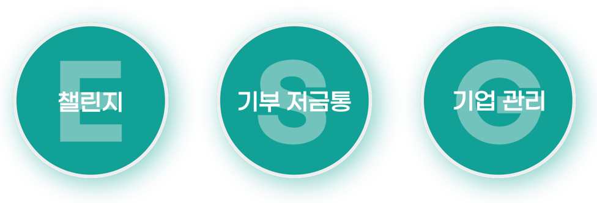
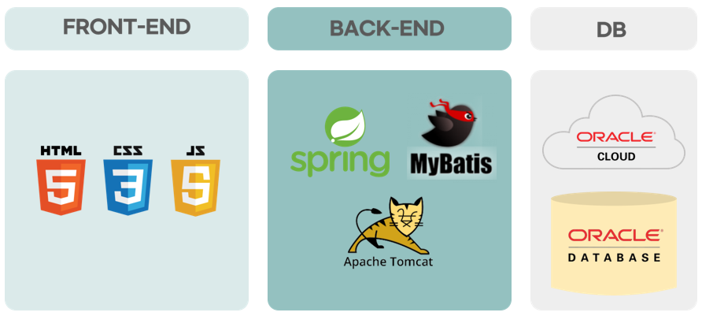
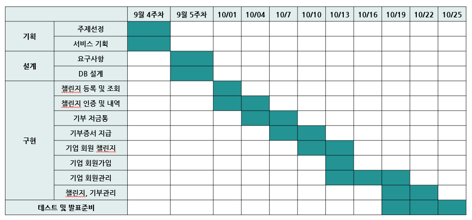
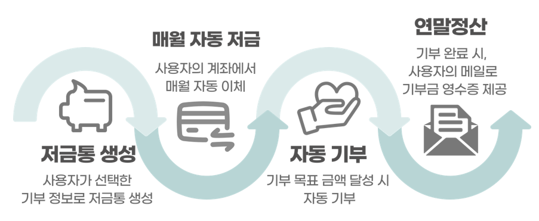
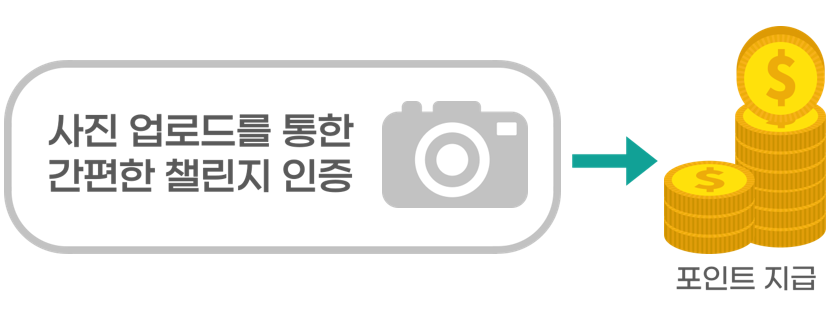
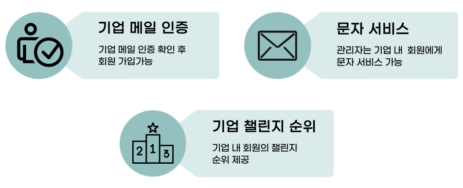
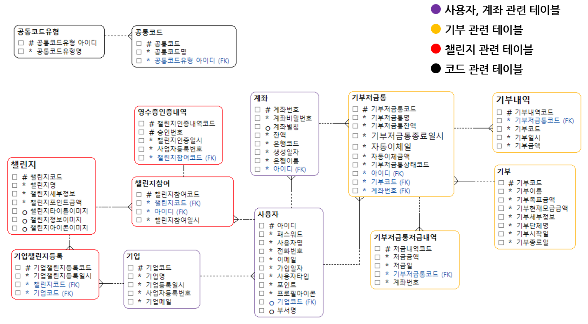
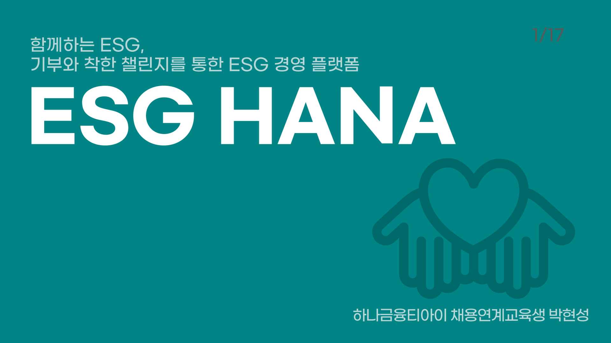

# ESGHANA_함께하는 ESG, 기부와 착한 챌린지를 통한 ESG 경영 플랫폼

    

# 1. 프로젝트 개요

## 1-1. 프로젝트 선정 배경 및 목적
#### 서비스 개요
1. 국내 소비자의 ESG경영에 대한 관심 증대
2. ESG 우수기업에 대한 다양한 혜택
3. 중소기업 10곳 중 9곳, ESG 도입에 어려움 

#### 서비스 목적
기업의 올바른 ESG경영 도입을 위한 ESG 경영 플랫폼으로 기업고객 유치와 'ESG 선두주자'로 나아갈 수 있습니다.

## 1-3. 프로젝트 개발환경 
### • OS : Windows10 
### • Server : Apache2, Tomcat 9 
### • Framework : Spring, MyBatis
  

## 1-4. Language / Tool / DataBase / VCS  
### • Language : Java, JavaScript, jQuery, HTML, CSS  
### • Tool : Eclipse, SQLDEV 
### • DataBase : Oracle 18c 
### • VCS : Github   

## 1-5. 시스템 아키텍처
  

## 1-6. 프로젝트 수행기간
  

  

# 2. 프로젝트 결과

## 2-1. 핵심기능
### 1. 기부저금통을 통한 편리한 기부서비스

● 사용자가 선택한 기부정보로 저금통 생상  
● 사용자의 계좌에서 기부저금통으로 매월 자동 이체  
● 기부목표금액 달성 시 자동 기부  
● 기부완료시 사용자의 메일로 기부증서 지급  
  

### 2. 착한 챌린지 - 환경을 생각하는 착한 챌린지 

● 사진업로드를 통한 간편한 챌린지 인증이 가능하고 챌린지 인증 시 즉시 포인트 지급 
  

### 3. 기업 회원 관리

● 기업 회원은 기업메일 인증 후 회원가입 가능 
● 기업관리자는 기업 내 회원에게 문자서비스 가능 
● 기업 내 회원의 챌린지 순위 제공 
  

## 2-2. ERD
  
  
## 2-3. 적용기술
### ○ Spring MVC 기반 웹 어플리케이션 개발
### ○ OCR을 활용한 이미지 텍스트 추출
### ○ Java MailSender를 사용한 기부증서 전송 서비스
### ○ Spring Scheduler를 사용한 자동 저금, 자동 기부 서비스
### ○ CoolSMS API를 이용한 기업 회원 문자 전송 기능
### ○ FullCalendar 라이브러리를 활용한 챌린지 인증 달력 서비스
  
  
# 3. 발표 PPT
[발표자료](/ESGHANA_PPT_최종본.pptx) 

# 4. 시연 동영상 

   
 
# 5. 본인 소개

|항목|내용||
|-----|---------------------------|----|
|이름 |박현성| |
|연락처 | 이메일 | gustjd68(@)naver.com |
|자격증| 2021.06.25 | SQLD ( 한국데이터산업진흥원 ) |
|skill set| Frontend | HTML, CSS, Javascript |
| | Backend | Java, Oracle, Spring, Python,django |
| | ETC | Git
|대외내활동| 2019년.03월 ~ 
2020년 12월 (22개월)| 멋쟁이 사자처럼 7, 8기 인천대학교 교육 담당 운영진(2019년.03월 ~ 2020년 11월)
→ Python Django 교육 진행 및 웹 프로젝트 개발 |
 2022년 03월 ~ 
2022년 11월 (09개월)| 한이음 ‘금융약자 청소년 대상 마이데이터를 활용한 공모주 주가변동 AI 예측 플랫폼’ 선정|

